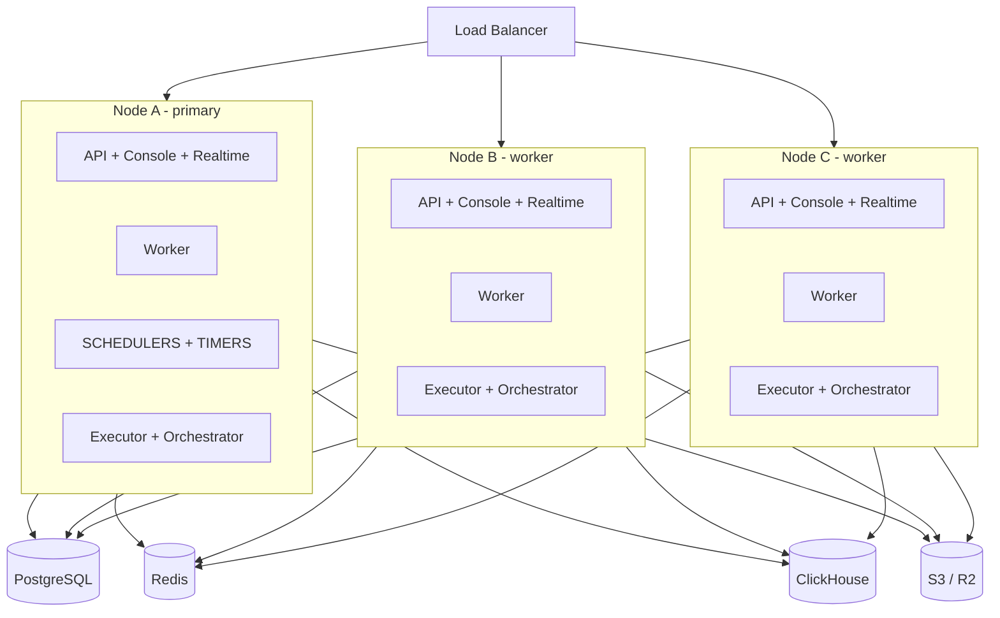

# Horizontal Scaling Guide

Run Appwrite across multiple servers behind a load balancer — for when one app server saturates.

> **Before you start**: this guide assumes you have already externalized PostgreSQL, Redis and ClickHouse onto their own servers (private network) and use S3/R2 for storage. Scaling a single-box installation is not covered — external state is the prerequisite. See the [production checklist](README.md#upgrading--notes) first.

---

## How Appwrite scales (the mental model)

Official basis: [Appwrite scaling docs](https://appwrite.io/docs/advanced/self-hosting/production/scaling) — *"Appwrite's functions and worker containers are stateless. To scale them, all you need is to replicate them and set up a load balancer to distribute their load."*



### The three golden rules

| Rule | Why |
|---|---|
| **1. Workers replicate freely** | Queue consumers compete for jobs on shared Redis queues — by design. More workers = more throughput. |
| **2. Timers run on exactly ONE node** | Schedulers fire scheduled functions on a clock. Two instances = every schedule fires twice. |
| **3. All nodes share identical secrets and version** | Tokens signed on node A must validate on node B; data written by A must be readable by B. |

### What runs where

| Component | Node A (primary) | Node B/C (workers) |
|---|---|---|
| API, Console, Realtime | ✅ | ✅ |
| Worker (combined or separate) | ✅ | ✅ |
| **Scheduler + Maintenance + Interval** (`timers` profile) | ✅ **only here** | ❌ |
| Executor + Orchestrator | ✅ | ✅ (each node runs its own, via its local docker.sock) |
| Databases (Postgres, Redis, ClickHouse) | external | external |

No sticky sessions are needed: sessions live in PostgreSQL and realtime events fan out over Redis pub/sub — any node can serve any request.

---

## Part 0 — Prerequisites checklist

- [ ] PostgreSQL, Redis, ClickHouse on their own servers, reachable from every future node over a **private network**
- [ ] One-time SQL run on the external Postgres (see block below) — a plain server lacks both objects
- [ ] ClickHouse HTTP interface verified: `curl http://<clickhouse-host>:8123/ping` returns `Ok.` — if it says *"Port 9000 is for clickhouse-client program"*, the port mapping is `8123:9000` and must be `8123:8123`
- [ ] Firewall rules: database ports (5432, 6379, 8123 — or your custom ports, e.g. 5411 for Postgres) accept connections **only** from app nodes' private IPs
- [ ] Storage device is S3/R2 (not Local) — all nodes must read/write the same files
- [ ] SMTP configured
- [ ] Node A deployed and healthy with `COMPOSE_PROFILES=combined,timers` (the default)
- [ ] Backups running (Postgres + S3 versioning + offline secrets copy)

**One-time SQL on the external Postgres.** The bundled template's postgres container does both of these automatically (`POSTGRES_DB` creates the database, and the `appwrite/postgres` image ships the collation pre-created); a plain external server does neither, and boot fails with `FATAL: database "appwrite" does not exist` or `ERROR: collation "utf8_ci_ai" for encoding "UTF8" does not exist`:

```sql
CREATE DATABASE appwrite;      -- name must match _APP_DB_SCHEMA
\c appwrite
CREATE COLLATION IF NOT EXISTS public.utf8_ci_ai (provider = icu,
  locale = 'und-u-ks-level1', deterministic = false);
```

The collation definition is Appwrite's own, taken verbatim from the official `utopia-php/database` Postgres adapter (case-insensitive + accent-insensitive — required by Appwrite's unique indexes). The `public.` prefix is the only addition; it just names the target schema explicitly.

---

## Part 1 — Prepare node A (primary)

### 1.1 Export the shared secrets

From node A's Coolify Environment tab, copy the **literal values** of every shared secret. These will be pasted into every additional node:

```
_APP_OPENSSL_KEY_V1          ← signs API/resource tokens; must be identical everywhere
_APP_DB_USER                 ← external Postgres credentials
_APP_DB_PASS
_APP_REDIS_USER              ← external Redis credentials (if Redis has auth)
_APP_REDIS_PASS
_APP_EXECUTOR_SECRET
_APP_JOBS_SECRET
_APP_GEO_SECRET
_APP_NOTIFICATIONS_TRACKING_SECRET
_APP_USAGE_PASS              ← ClickHouse password
```

> If you override the full ClickHouse DSNs (`_APP_CONNECTIONS_DB_USAGE` / `_APP_CONNECTIONS_DB_EXECUTIONS`), copy those literal values to every node too — otherwise the defaults rebuild them from `_APP_USAGE_PASS` and the hosts.

Also note the exact values of:

```
_APP_VERSION                 ← all nodes must match
_APP_DB_HOST                 ← e.g. 10.0.0.10 (private IP)
_APP_REDIS_HOST              ← e.g. 10.0.0.11 (private IP)
_APP_DOMAIN                  ← same on all nodes
```

> **Important:** each Coolify stack generates its **own** magic-variable secrets. On nodes B+ you will *replace* the generated references with node A's literal values — do not keep `$SERVICE_PASSWORD_64_APPWRITE` style references on those nodes, because they resolve to different random strings.

### 1.2 Confirm node A runs the timers

Node A's Environment tab must have:

```
COMPOSE_PROFILES=combined,timers
```

This is the template default — verify it, don't assume it.

---

## Part 2 — Deploy node B (the copy-paste part)

### 2.1 Deploy the identical compose file

On node B's Coolify (or the same Coolify, different server destination): New Resource → Docker Compose → paste the **same** `docker-compose-appwrite-include-dbs.yaml`.

### 2.2 Set the env differences

Node B's Environment tab differs from node A in exactly these ways:

| Variable | Node A | Node B |
|---|---|---|
| `COMPOSE_PROFILES` | `combined,timers` | **`combined`** ← the key difference: no timers |
| All shared secrets (list above) | (generated / original values) | **paste node A's literal values** |
| `_APP_VERSION` | e.g. `2.0.0` | **same** |
| `_APP_DB_HOST`, `_APP_REDIS_HOST` | private IPs | **same private IPs** |
| `_APP_DOMAIN` | your hostname | **same** |
| `_APP_BUILDS_VOLUME` | stack-specific | irrelevant with S3 storage — leave default |

Everything else identical. Yes, node B's stack status badge will show the parked timer services as "Exited" — expected, they live on node A only.

### 2.3 Domains on node B

Configure the same three routed services with the same hostnames and paths as node A (`/v1`, `/`, `/v1/realtime`) so node B's local proxy accepts the Host header. The public DNS will not point here — the load balancer decides which node receives traffic (Part 3).

Also set **Keep prefixes** on the Appwrite and Realtime services, exactly like node A (Advanced → Path prefixes → Keep prefixes).

### 2.4 Deploy and verify node B standalone

Before adding it to the load balancer, confirm node B works:

```bash
# From node B (or any node) against node B's own tunnel/proxy endpoint:
curl https://<node-b-endpoint>/v1/health/version
# → {"version":"2.0.0"}

# And confirm shared-state connectivity: create a row via node B's API,
# read it back via node A's API. Same data = shared DBs work.
```

### 2.5 Repeat for node C, D, ...

Identical to Part 2. Every additional node is another copy of Part 2 with `COMPOSE_PROFILES=combined`.

---

## Part 3 — The load balancer

Pick one. All work; choose what fits your stack.

### Option A — Cloudflare Load Balancer (recommended if you use Cloudflare tunnels)

1. Cloudflare dashboard → Traffic → Load Balancing → Create
2. **Origin pools**: one pool per node — each pool's origin is that node's tunnel (or server IP)
3. **Monitor**: HTTP monitor on `https://your.hostname/v1/health/version`, expect `200`
4. **Steering**: standard failover or round-robin across pools
5. Point `_APP_DOMAIN`'s DNS record at the LB hostname

Websockets are supported; no sticky sessions required.

### Option B — Hetzner Load Balancer (~€6/mo, pairs with your private network)

1. Create LB in the same network/location as your nodes
2. Services: TCP 443 (and 80 for redirect) → targets = both nodes' proxy IPs
3. Health check: HTTP on `/v1/health/version`
4. Point DNS at the LB's public IP

### Option C — DIY (HAProxy/Nginx on a tiny node)

Full control, your maintenance burden. Required features: websocket pass-through, per-node health checks on `/v1/health/version`, TLS termination or TCP passthrough to node proxies.

> **Official note** (from Appwrite's scaling docs): route **all** communication through the load balancer, not directly to individual replicated containers. External clients (your apps, SDKs) should only ever know the LB hostname.

---

## Part 4 — Verification checklist

- [ ] `https://your.hostname/v1/health/version` returns 200 (through the LB)
- [ ] LB console shows all pools healthy
- [ ] Register a session via one node, use it on another (logout/login across LB) — validates shared sessions
- [ ] Create a table row via the API, read it via a direct request to node B — validates shared Postgres
- [ ] Trigger a realtime event, subscribe through the LB — validates Redis pub/sub across nodes
- [ ] Deploy a scheduled test function (every minute) — confirm it fires **exactly once per minute** (validates timers-once)
- [ ] Deploy a site/function build — confirm it succeeds on whichever node's executor picks it up

---

## Operations

### Adding a node

Part 2, verbatim. Then add its pool to the LB.

### Removing a node

1. Remove its pool from the LB first (drain traffic)
2. Stop/delete the stack in Coolify
3. Done — nothing stateful lived there

### Upgrading (rolling)

1. Back up Postgres
2. Remove node B..N from the LB (or leave them, see note)
3. Bump `_APP_VERSION` on node A → deploy → verify health
4. Bump `_APP_VERSION` on B..N → deploy → verify → re-add to LB

> Note: keep versions matched across nodes at all times. A mixed-version fleet can produce subtle serialization/cache incompatibilities even when both versions "work".

### Monitoring

- LB health checks (per node) on `/v1/health/version`
- Each node's Coolify stack badge (the Appwrite service's origin-guard healthcheck catches domain misconfig per node)
- Watch per-node disk (build scratch + images) — see README notes on disk usage

---

## Troubleshooting

| Symptom | Cause | Fix |
|---|---|---|
| Node B API 401s every token that node A issued | Secrets differ between nodes (each stack generated its own) | Paste node A's literal secret values into node B's env |
| Scheduled functions fire twice | Timers running on more than one node | Exactly one node runs `COMPOSE_PROFILES` containing `timers` |
| Works via node A directly, 502/404 via LB | LB routing to wrong port, or Host header stripped | LB target must be the node's proxy (443), Host header preserved |
| Sessions randomly log out | Sticky-session-less LB is fine — but check all nodes share the same `_APP_OPENSSL_KEY_V1` | Same fix as token 401s |
| Realtime works on one node, not another | That node's `/v1/realtime` routing (path stripped or port wrong) | Keep prefixes + correct paths on every node |
| Build succeeds on A, fails on B | Node B missing runtime image or disk space | Check executor env (`_APP_EXECUTOR_IMAGES`) and free disk on B |
| Node B can't reach databases | Firewall or private network misconfiguration | Ports 5432/6379/8123 open only between app nodes and DB servers over private IPs |

---

## FAQ

**When should I scale horizontally?**
When one app server saturates: sustained high CPU, worker queue backlogs (check worker logs for lag), or you need availability redundancy. A single well-sized node with the combined worker handles a lot — scale on evidence, not anticipation.

**Isn't the databases' private-network latency a problem?**
Within one region/provider private network (~0.2–0.5 ms) it's negligible. Across regions or over the public internet — it is a problem; don't.

**Can nodes be in different regions?**
Not recommended: Redis is on nearly every request path. Keep all nodes in the same region as the databases.

**Can I mix combined and separate topologies across nodes?**
Yes — node A could run `separate,timers` while B runs `combined`. Never run both topologies on the *same* node (official rule: queue consumers would race).

**Do I need Coolify on every node?**
No — Coolify can manage multiple servers. One Coolify, several server destinations, one stack per node.

---

## References

- [Official Appwrite scaling docs](https://appwrite.io/docs/advanced/self-hosting/production/scaling)
- [Worker topologies](https://appwrite.io/docs/advanced/self-hosting/configuration/topologies)
- [Template README](README.md) — deploy guide, profiles, troubleshooting
